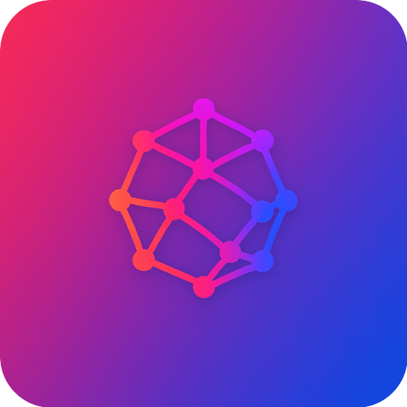

<p align="center">
  
</p>

<h1 align="center">Socialmesh</h1>

<p align="center">
  <strong>The mesh network in your pocket.</strong><br>
  A powerful Meshtastic companion app for iOS and Android.
</p>

<p align="center">
  <a href="#features">Features</a> •
  <a href="#nodedex">NodeDex</a> •
  <a href="#signals">Signals</a> •
  <a href="#getting-started">Getting Started</a> •
  <a href="#building-from-source">Build</a> •
  <a href="#contributing">Contributing</a>
</p>

<p align="center">
  
  
  
  
</p>

<p align="center">
  <a href="https://socialmesh.app">Website</a> •
  <a href="https://apps.apple.com/app/id6742694642">iOS App</a> •
  <a href="https://play.google.com/store/apps/details?id=com.gotnull.socialmesh">Android App</a> •
  <a href="https://github.com/gotnull/socialmesh/issues">Issues</a>
</p>

---

Connect to your mesh radio, exchange messages, track nearby nodes, and configure your device — **all without internet**.

Socialmesh works fully offline over BLE and USB. Firebase is optional for cloud sync, widget marketplace, and profile sharing.

---

## NodeDex

> _Your personal mesh field journal._

Every node you discover on the mesh is automatically catalogued in the **NodeDex** — a living record of your mesh encounters. Each node receives a unique **procedural Sigil** (a geometric glyph derived deterministically from its identity) and a **personality Trait** inferred from real behavioral data. Accessible from the drawer menu.

### Procedural Sigils

Every node gets a unique constellation-style geometric identity generated from its node number. The same node always produces the same sigil — no randomness, no variation. Sigils are built from outer polygons (3-8 vertices), optional inner rings, radial lines, and a unique 3-color palette drawn from 16 curated colors.

### Personality Traits

Traits are never user-assigned — they are passively inferred from observable telemetry and behavior:

| Trait | Description |
|---|---|
| **Relay** | Router role with high throughput — forwards traffic for the mesh |
| **Wanderer** | Seen across multiple distinct positions or regions |
| **Sentinel** | Fixed position, long-lived, high encounter count |
| **Beacon** | Always active, very frequent encounters |
| **Ghost** | Rarely seen relative to age — elusive presence |
| **Courier** | High message volume relative to encounters |
| **Anchor** | Persistent hub with many co-seen connections |
| **Drifter** | Irregular timing, unpredictable appearance pattern |

Each trait includes a confidence score and evidence lines explaining the classification.

### Patina Score

A numerical measure (0-100) of how much observable history a node has accumulated, computed across six axes: tenure, encounters, geographic reach, signal depth, social connections, and recency. Early gains are meaningful; diminishing returns prevent runaway scores.

### Progressive Disclosure

Information is revealed as observation accumulates — new nodes start sparse, detail unlocks over time:

| Tier | Name | What appears |
|---|---|---|
| 0 | Trace | Sigil, name, hex ID only |
| 1 | Noted | Primary trait badge |
| 2 | Logged | Trait evidence and field note |
| 3 | Inked | Full trait list and patina stamp |
| 4 | Etched | Identity overlay at full density |

### Sigil Evolution

Sigils visually mature as patina accumulates — subtle line weight changes, color deepening, and micro-etch detail that progresses through five stages: **Seed**, **Marked**, **Inscribed**, **Heraldic**, and **Legacy**.

### Sigil Cards

Collectible trading-card-style renders of a node's full identity — rarity-tiered borders, dramatic sigil display, RPG-style stat grids, and shareable PNG export. Accessible from the NodeDex detail screen and the Nodes screen.

### Field Notes

Deterministic single-line observations that read like entries in a naturalist's field journal. The same node always gets the same note. Template families are selected by trait and filled with concrete values from the node's history.

### Social Tags

User-assigned labels for discovered nodes: **Contact**, **Trusted Node**, **Known Relay**, and **Frequent Peer**. Filter and sort the NodeDex by tag.

### Co-Seen Tracking

Records which nodes have been observed together on the mesh, building a social graph of node relationships over time.

---

## Signals

> _Leave short, ephemeral traces for people nearby._

Signals is a mesh-first way to communicate. Drop a message, and it appears to everyone in range. Signals expire automatically with configurable TTL and never leave the mesh. Sorted by proximity and expiry. No followers. No likes. No algorithms. **Just presence.**

Think of it as digital graffiti that fades with time.

---

## Features

### Messaging

| Feature | Description |
|---|---|
| **Channel Messaging** | Send and receive on multiple channels simultaneously |
| **Direct Messages** | Private, encrypted node-to-node communication |
| **Quick Responses** | Pre-configured canned messages for fast replies |
| **Message Search** | Full-text search across all conversations |
| **Offline Queue** | Messages queued when disconnected, sent automatically on reconnect |
| **Reactions** | React to messages with emoji responses |

### Network and Nodes

| Feature | Description |
|---|---|
| **Node Discovery** | See all nodes with signal strength, battery, and location |
| **NodeDex** | Personal mesh field journal with procedural sigils and trait inference |
| **Network Topology** | Visual graph showing mesh interconnections |
| **Traceroute** | Trace the exact path packets take through the mesh |
| **Signal History** | SNR and RSSI charts over time |
| **Favorites** | Pin important nodes for quick access |
| **Node Profiles** | Rich profiles with user info, social links, and custom avatars |
| **Presence** | Track when nodes are online, their activity patterns, and last seen times |

### Maps and Location

| Feature | Description |
|---|---|
| **Node Map** | Interactive map with all GPS-enabled nodes |
| **Waypoints** | Drop, share, and navigate to waypoints |
| **Location Sharing** | Broadcast your position to the mesh |
| **Map Styles** | Street, satellite, and terrain views |
| **Route Recording** | Record and save your routes with GPS tracks |

### Social

| Feature | Description |
|---|---|
| **Activity Timeline** | Chronological feed of mesh activity and events with identity resolution |
| **Social Profiles** | View user profiles with posts, followers, and social links |
| **Signals Feed** | Ephemeral mesh-first content sorted by proximity and expiry |

### Device Configuration

Full control over your Meshtastic device:

- **LoRa** — Region, modem preset, hop limit, frequency slot
- **Power** — Sleep mode, shutdown timeout, power saving
- **Position** — GPS mode, broadcast interval, smart position
- **Bluetooth** — Pairing mode, PIN code, power settings
- **Network** — WiFi, Ethernet, MQTT bridge
- **Display** — Timeout, brightness, flip screen, OLED burn-in protection
- **Detection Sensor** — Motion and door sensor triggers
- **Canned Messages** — On-device quick responses

### Audio

- **7,000+ RTTTL Ringtones** — Organized by category, preview before sending
- **Custom Compositions** — Create and save your own ringtones

### Integrations

- **IFTTT Webhooks** — Trigger automations on node events and geofence alerts
- **MQTT Bridge** — Internet uplink configuration
- **QR Codes** — Import/export channels and share node info instantly
- **Nothing Phone Glyph** — LED pattern notifications for mesh events (Nothing Phone only)

### Safety

- **Emergency SOS** — One-tap broadcast with optional GPS coordinates
- **Geofence Alerts** — Notifications when nodes leave defined areas
- **Battery Alerts** — Low battery warnings for tracked nodes

### Visualization

| Feature | Description |
|---|---|
| **3D Mesh View** | Interactive 3D visualization of your mesh network topology |
| **World Map** | Global view of Meshtastic nodes from the public MQTT network |
| **Globe View** | 3D rotating globe with node positions plotted worldwide |
| **Timeline** | Chronological feed of all mesh activity and events |

### Analytics and Monitoring

| Feature | Description |
|---|---|
| **Mesh Health** | Real-time network health metrics, utilization graphs, and issue detection |
| **Reachability** | Probabilistic assessment of node reachability based on observed data |
| **Presence** | Track when nodes are online, their activity patterns, and last seen times |
| **Route Analysis** | View discovered routes and packet paths through the mesh |
| **Telemetry Logs** | Device metrics, environment sensors, air quality, position history |

### Premium Features

These features are available via one-time in-app purchases:

| Feature | Description |
|---|---|
| **Theme Pack** | 12 accent colors to personalize the entire app |
| **Ringtone Pack** | 7,000+ searchable RTTTL ringtones — classic tunes, TV themes, games |
| **Widgets** | Build custom dashboard widgets with live data, charts, and gauges |
| **Automations** | Create rules that trigger alerts, send messages, and react to events |
| **IFTTT Integration** | Connect your mesh to 700+ apps and services via webhooks |

---

## Tech Stack

| Layer | Technology |
|---|---|
| **UI Framework** | Flutter 3.10+ |
| **State Management** | Riverpod 3.x |
| **Protocol** | Meshtastic Protobufs |
| **Local Storage** | SQLite |
| **Analytics** | Firebase (optional) |
| **Sigil Generation** | Deterministic geometric identity |
| **Trait Inference** | Passive behavioral classification |

---

## Documentation

- [Architecture Overview](docs/ARCHITECTURE.md) — How the app is structured
- [Backend Boundary](docs/BACKEND.md) — What requires cloud services
- [Releasing](docs/RELEASING.md) — How to cut a release

---

## Getting Started

### Prerequisites

| Requirement | Version |
|---|---|
| Flutter SDK | 3.10+ |
| Xcode | 15+ (iOS) |
| Android Studio | SDK 34+ |
| Protocol Buffers | `brew install protobuf` |
| CocoaPods | `sudo gem install cocoapods` (iOS) |

### Quick Start (Demo Mode)

Run the app without backend configuration using demo mode:

```bash
# Clone and bootstrap
git clone https://github.com/gotnull/socialmesh.git
cd socialmesh
./tool/dev_bootstrap.sh

# Run in demo mode (no backend required)
flutter run --dart-define=SOCIALMESH_DEMO=1
```

Demo mode provides sample nodes and messages so you can explore the UI immediately.

### Production Build

For production builds, demo mode is disabled by default. Configure Firebase and other services as documented below.

```bash
# Install dependencies
flutter pub get

# Generate Meshtastic protobufs
./scripts/generate_protos.sh

# Run on connected device
flutter run
```

### Project Structure

```
lib/
├── core/           # Theme, shared widgets, constants, safety utilities
├── features/       # Feature modules
│   ├── automations/# Rule-based event automation engine
│   ├── channels/   # Channel messaging
│   ├── dashboard/  # Custom widget dashboard
│   ├── device/     # Device configuration
│   ├── globe/      # 3D globe visualization
│   ├── map/        # Interactive node map
│   ├── mesh3d/     # 3D mesh topology view
│   ├── mesh_health/# Network health analytics
│   ├── messaging/  # Direct and channel messaging
│   ├── nodedex/    # Mesh field journal (sigils, traits, patina)
│   ├── presence/   # Node presence tracking
│   ├── reachability/# Node reachability analysis
│   ├── signals/    # Ephemeral mesh-first content
│   ├── social/     # Activity timeline, profiles
│   ├── widget_builder/ # Custom dashboard widget editor
│   ├── world_mesh/ # Global MQTT node map
│   └── ...         # Additional feature modules
├── generated/      # Meshtastic protobuf code
├── models/         # Data models
├── providers/      # Riverpod state management
├── services/       # Protocol, storage, transport layers
└── utils/          # Utilities and helpers
```

---

## Building from Source

### What works out of the box

- BLE and USB connection to Meshtastic devices
- All mesh communication (messaging, node discovery, channels)
- Local SQLite storage (NodeDex, signals, routes, packet deduplication)
- Protobuf encoding/decoding
- NodeDex with procedural sigils and trait inference

### Optional: Firebase

The app uses Firebase for optional cloud features. Without configuration:

| Feature | Behavior |
|---|---|
| Analytics/Crashlytics | Disabled silently |
| Cloud sync | Falls back to local-only |
| Authentication | Sign-in unavailable |
| Social features | Local-only mode |

To enable, add your own `google-services.json` (Android) and `GoogleService-Info.plist` (iOS).

### Build Commands

```bash
# Install dependencies
flutter pub get

# Generate Meshtastic protobufs
./scripts/generate_protos.sh

# iOS
cd ios && pod install && cd ..
flutter build ios

# Android
flutter build apk                    # Debug APK
flutter build apk --release          # Release APK
flutter build appbundle --release    # Play Store bundle
```

### Build Outputs

| Platform | Location |
|---|---|
| iOS | `build/ios/ipa/` |
| Android APK | `build/app/outputs/flutter-apk/` |
| Android Bundle | `build/app/outputs/bundle/release/` |

---

## URL Scheme

Socialmesh registers `socialmesh://` for deep linking:

```
socialmesh://channel/<base64>   # Import channel configuration
socialmesh://node/<base64>      # Import node information
```

---

## Project Status

Socialmesh is a fully functional Meshtastic companion app available on iOS and Android. The codebase is stable and actively maintained.

### Contributions Welcome

- Bug fixes and performance improvements
- New device configuration options as Meshtastic firmware evolves
- UI/UX polish and accessibility improvements
- Documentation and translations
- Test coverage

### Out of Scope

The following are intentionally excluded from this repository:

- Backend services, cloud functions, and APIs (proprietary)
- Payment processing and subscription infrastructure
- App Store/Play Store publishing workflows
- Marketing materials and promotional content

---

## Contributing

We welcome contributions! Please read our [Contributing Guide](CONTRIBUTING.md) before submitting a PR.

See [SECURITY.md](SECURITY.md) for reporting vulnerabilities.

---

## License

This mobile application is licensed under the **GNU General Public License v3.0** (GPL-3.0-or-later).

You are free to use, modify, and distribute this software under the terms of the GPL-3.0. See [LICENSE](LICENSE) for details.

### Scope

| Component | License |
|---|---|
| **Mobile app** (this repository) | GPL-3.0 — source code provided here |
| **Backend services** | Proprietary — not included |

### Third-Party Notices

See [NOTICE.md](NOTICE.md) for attribution of third-party components including Meshtastic protobufs.

---

## Maintainer Setup

For repository maintainers:

1. Enable branch protection on `main`
2. Require pull requests with at least one approval
3. Require CI status checks to pass before merging
4. Disallow force pushes to `main`

---

## Resources

- [Architecture Overview](docs/ARCHITECTURE.md)
- [Backend Boundary](docs/BACKEND.md)
- [Contributing Guide](CONTRIBUTING.md)
- [Security Policy](SECURITY.md)

---

<p align="center">
  <strong>Built for the mesh. Built for you.</strong>
</p>